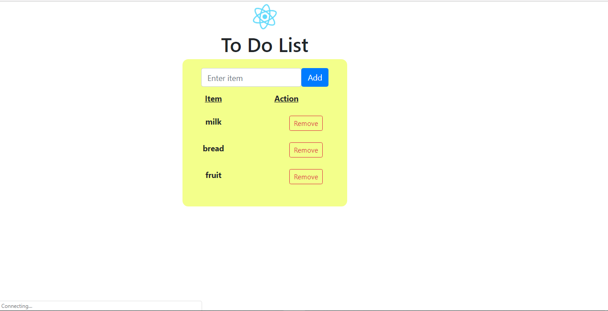

# Shopping-List-React
Shopping list using react js

#go to the shopping list folder on your terminal and
type nom install to install node_module, then npm start to start the app

<b>Shopping List</b>

